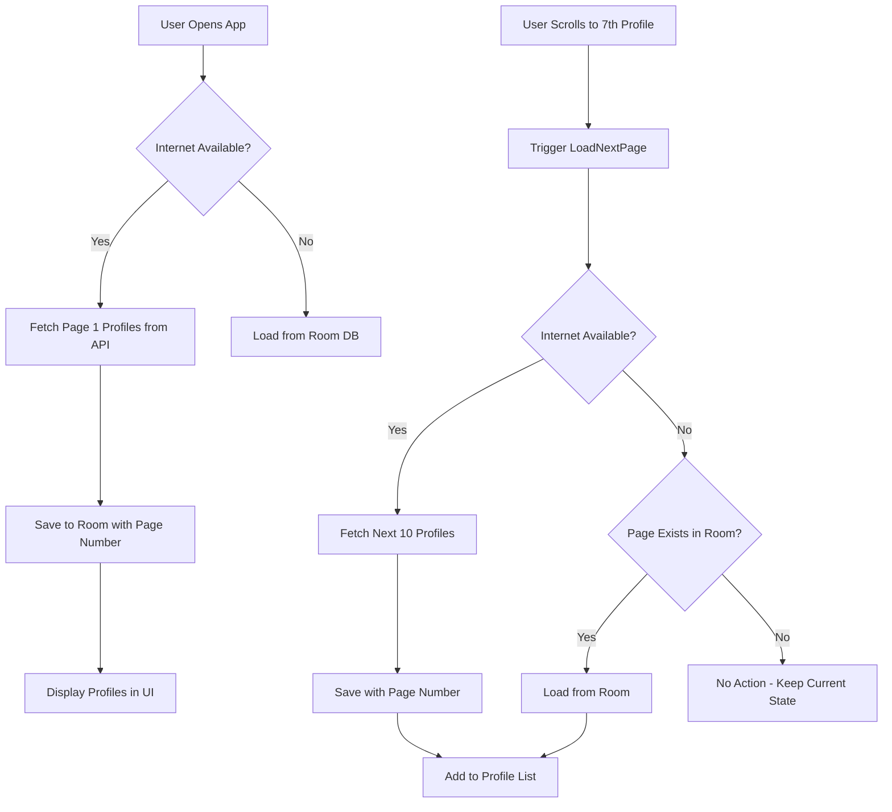

# 💕 MatchMate - Matrimonial App with Offline-First Architecture

<div align="center">


*A modern Android matrimonial app built with Clean Architecture, offline-first approach, and
intelligent pagination for finding life partners*

</div>

## 🏗️ Architecture Overview

MatchMate follows **Clean Architecture** principles with **MVVM pattern** and **offline-first** data
strategy, ensuring a smooth user experience regardless of network connectivity for matrimonial
matches.

```
┌─────────────────────────────────────────────────────────┐
│                   PRESENTATION LAYER                    │
├─────────────────────────────────────────────────────────┤
│  📱 Composables  │  🎯 ViewModels  │  📋 UI States       │
│  • MatchmateScreen  • MatchmateViewModel  • MatchmateState │
│  • ProfileCards    • Actions & Events    • Loading States │
└─────────────────────────────────────────────────────────┘
                            │
┌─────────────────────────────────────────────────────────┐
│                    DOMAIN LAYER                         │
├─────────────────────────────────────────────────────────┤
│  🎲 Use Cases     │  📜 Repository Interface             │
│  • GetMatchmateDataUseCase  • MatchMateRepository        │
│  • Business Logic          • Domain Models              │
└─────────────────────────────────────────────────────────┘
                            │
┌─────────────────────────────────────────────────────────┐
│                     DATA LAYER                          │
├─────────────────────────────────────────────────────────┤
│  🌐 Remote        │  💾 Local         │  🔄 Repository   │
│  • API Service    │  • Room Database  │  • Implementation │
│  • DTOs           │  • Entities       │  • Mappers       │
│  • Retrofit       │  • DAOs           │  • Caching Logic │
└─────────────────────────────────────────────────────────┘
```

## 🚀 Key Features

### 💎 Smart Pagination System

- **Intelligent Loading**: Fetches 10 profiles initially, triggers next batch at 7th profile
- **Page-by-Page Caching**: Each API page is stored separately in Room database
- **Offline Continuation**: Seamlessly switches between cached and fresh profile data

### 🌐 Offline-First Architecture
- **Network Resilience**: App works perfectly without internet connection
- **Smart Data Sync**: Auto-refreshes when connectivity returns
- **Local Preference Persistence**: Like/dislike preferences saved locally for matrimonial matches

### 🎨 Modern UI/UX
- **Jetpack Compose**: 100% declarative UI with Material Design 3
- **Profile Interactions**: Elegant profile browsing with swipe gestures
- **Responsive Design**: Adaptive layouts for different screen sizes

## 📚 Technology Stack

### 🛠️ Core Technologies
```kotlin
• Kotlin - Modern programming language
• Jetpack Compose - Declarative UI toolkit
• Coroutines & Flow - Asynchronous programming
• Material Design 3 - Modern design system
```

### 🏗️ Architecture Components
```kotlin
• Hilt - Dependency injection
• Room - Local database
• ViewModel - UI state management
• Navigation Compose - Type-safe navigation
```

### 🌐 Network & Data
```kotlin
• Retrofit - HTTP client
• Kotlinx Serialization - JSON parsing
• Chucker - Network debugging
• Coil - Image loading
```

### 🧪 Development Tools
```kotlin
• Kotlin Gradle DSL - Build configuration
• Version Catalogs - Dependency management
• ProGuard - Code obfuscation
```

## 📊 Data Flow Architecture

### 🔄 Intelligent Profile Loading Flow



### 💾 Database Schema

```sql
-- Room Database Structure for matrimonial profiles
CREATE TABLE match_mate_results (
    uuid TEXT PRIMARY KEY,
    -- Basic profile info
    cell TEXT, email TEXT, gender TEXT,
    -- Age and birth details
    dob_age INTEGER, dob_date TEXT,
    -- Location for matrimonial matching
    location_city TEXT, location_country TEXT,
    location_coordinates_latitude TEXT,
    location_coordinates_longitude TEXT,
    -- Profile pictures
    picture_large TEXT, picture_medium TEXT, picture_thumbnail TEXT,
    -- Matrimonial preference status (INTERESTED, NOT_INTERESTED, NOT_DECIDED)
    match_status TEXT,
    -- Pagination tracking
    page_number INTEGER,
    created_at INTEGER
);
```

## 🎯 Smart Caching Strategy

### 📱 How Profile Pagination Works

1. **Initial Load** 📥
   ```kotlin
   • Fetch first 10 matrimonial profiles from API
   • Save to Room with page_number = 1
   • Display in UI for user review
   ```

2. **Scroll Trigger** 🔄
   ```kotlin
   • User reaches 7th profile while browsing
   • Trigger LoadNextPageData action
   • Check internet connectivity
   ```

3. **Online Behavior** 🌐
   ```kotlin
   • Fetch next 10 profiles (page 2)
   • Save with page_number = 2
   • Append to existing profile list
   ```

4. **Offline Behavior** 📴
   ```kotlin
   • Check if page 2 exists in Room
   • If exists: Load cached profiles
   • If not exists: No action (keep current profiles)
   ```

5. **Internet Recovery** 🔁
   ```kotlin
   • Auto-detect connectivity restoration
   • Continue pagination from last requested page
   • Sync new profiles to Room database
   ```

## 🏛️ Project Structure

```
app/src/main/java/com/match/matchmate/
├── 📱 presentation/
│   ├── matchMate/
│   │   ├── MatchmateScreen.kt          # Main profile browsing UI
│   │   ├── viewmodel/
│   │   │   └── MatchmateViewModel.kt   # Profile management logic
│   │   ├── contracts/
│   │   │   ├── MatchmateState.kt       # UI state for profiles
│   │   │   ├── MatchmateAction.kt      # User actions (like/dislike)
│   │   │   └── MatchmateEvent.kt       # UI events
│   │   └── components/                 # Profile UI components
│   ├── navigation/
│   │   └── NavigationRoutes.kt         # App navigation routes
│   └── base/components/                # Shared components
├── 🎯 domain/
│   ├── usecase/
│   │   └── GetMatchmateDataUseCase.kt  # Profile fetching use cases
│   └── repository/
│   │   └── MatchMateRepository.kt      # Repository interface
├── 💾 data/
│   ├── local/
│   │   ├── entity/
│   │   │   └── MatchMateEntity.kt      # Room entity for profiles
│   │   ├── dao/
│   │   │   └── MatchMateDao.kt         # Database operations
│   │   ├── database/
│   │   │   └── MatchMateDatabase.kt    # Room database
│   │   └── datasource/
│   │       └── MatchMateLocalDataSource.kt
│   ├── service/
│   │   └── MatchMateApiService.kt      # API endpoints
│   ├── repository/
│   │   └── MatchMateRepositoryImpl.kt  # Repository implementation
│   ├── mapper/
│   │   └── MatchMateMapper.kt          # Data transformations
│   ├── model/
│   │   └── MatchMateDto.kt             # API models
│   └── di/
│       ├── NetworkModule.kt            # Network DI
│       └── DatabaseModule.kt           # Database DI
└── 🎨 theme/
    ├── Color.kt, Theme.kt, Type.kt     # Material Design 3
```

## 🔧 Key Implementation Details

### 🎯 ViewModel State Management
```kotlin
data class MatchmateState(
    val isLoading: Boolean = false,
    val isInternetAvailable: Boolean = true,
    val matchMateResponse: MatchMateDto = MatchMateDto(),
    val currentPage: Int = 0,           // Last successfully loaded page
    val pageToLoad: Int = 1,            // Next page to request
    val hasMorePages: Boolean = true
)
```

### 🌐 Smart Repository Logic
```kotlin
override suspend fun getMatchmateData(page: Int, limit: Int): Flow<BaseUiState<MatchMateDto?>> = flow {
    if (internetChecker.isInternetAvailable) {
        // 🌐 Online: Fetch profiles from API + Cache
        val apiResult = safeApiCall { apiService.getAllUsers(page, limit) }
        apiResult.collect { response ->
            when (response) {
                is BaseUiState.Success -> {
                    // Save profiles with page number for intelligent caching
                    localDataSource.insertMatchMates(response.data.results.toEntityList(page))
                    emit(response)
                }
            }
        }
    } else {
        // 📴 Offline: Check if specific page exists
        if (localDataSource.hasPageData(page)) {
            val cachedProfiles = localDataSource.getMatchMatesByPage(page)
            emit(BaseUiState.Success(cachedProfiles.toDto()))
        } else {
            // No profiles for this page - don't show empty state
            emit(BaseUiState.Success(MatchMateDto(results = emptyList())))
        }
    }
}
```

### 🎨 Compose UI Structure
```kotlin
@Composable
fun MatchmateScreen(state: MatchmateState, onAction: (MatchmateAction) -> Unit) {
    VerticalPager(
        pageCount = { maxOf(1, state.matchMateResponse.results.size) },
        key = { index -> state.matchMateResponse.results[index].login.uuid }
    ) { index ->
        ProfileSwipeCard(
            onSwipeLeft = { onAction(MatchmateAction.DislikeClicked(uuid, index)) },
            onSwipeRight = { onAction(MatchmateAction.LikeClicked(uuid, index)) }
        ) {
            MatrimonialProfileComponent(userData = state.matchMateResponse.results[index])
        }
    }
}
```

## 🚀 Getting Started

### 📱 Quick Download

**Ready to try MatchMate? Download the latest APK:**

<div align="center">

[]([https://github.com/yourusername/matchmate/releases/latest/download/matchmate-debug.apk](https://github.com/HimanskDevStuff/MatchMate/releases/tag/v1.0.0))

</div>


> **Note**: Debug APK includes [Chucker](https://github.com/ChuckerTeam/chucker) for real-time
> network traffic inspection and debugging.

### Prerequisites
- Android Studio Arctic Fox or later
- Kotlin 1.9.0+
- Gradle 8.0+
- Min SDK 24, Target SDK 34

### Installation

1. **Clone the repository**
   ```bash
   git clone https://github.com/yourusername/matchmate.git
   cd matchmate
   ```

2. **Open in Android Studio**
   ```bash
   # Import project in Android Studio
   File → Open → Select project folder
   ```

3. **Build and Run**
   ```bash
   ./gradlew assembleDebug
   # Or use Android Studio's Run button
   ```

## 🛠️ Configuration

### 🌐 API Configuration
```kotlin
// app/build.gradle.kts
buildTypes {
    debug {
        buildConfigField("String", "API_BASE_URL", "\"https://randomuser.me\"")
    }
}
```

### 🔍 Debug Tools
- **Chucker**: Network inspection (Debug builds only)
- **Room Inspector**: Database debugging
- **Layout Inspector**: UI debugging

## 🧪 Testing Strategy

### Unit Tests
- ViewModel business logic
- Repository caching behavior
- Use case implementations

### Integration Tests
- Room database operations
- Network + caching flow
- Offline/online transitions

## 🎨 UI/UX Features

### 🎭 Animations & Interactions

- **Smooth Profile Gestures**: Natural profile browsing with physics
- **Loading States**: Skeleton loading and progress indicators
- **Transition Animations**: Seamless screen transitions
- **Interest Confirmations**: Delightful interaction feedback

### 📱 Responsive Design
- **Adaptive Layouts**: Works on phones and tablets
- **Dark Mode Support**: Automatic theme switching
- **Accessibility**: Screen reader and navigation support

## 🔮 Future Enhancements

- [ ] **Advanced Filters**: Age, location, education, profession
- [ ] **Family Details**: Extended family information
- [ ] **Horoscope Integration**: Astrological compatibility
- [ ] **Video Introductions**: Personal video profiles
- [ ] **Interest Management**: Mutual interest tracking
- [ ] **Community Features**: Trusted network recommendations

## 👥 Contributing

We welcome contributions! Please read our [Contributing Guidelines](CONTRIBUTING.md) before
submitting PRs.

### Development Workflow
1. Fork the repository
2. Create feature branch (`git checkout -b feature/amazing-feature`)
3. Commit changes (`git commit -m 'Add amazing feature'`)
4. Push to branch (`git push origin feature/amazing-feature`)
5. Open Pull Request

## 📄 License

This project is licensed under the MIT License - see the [LICENSE](LICENSE) file for details.

## 🤝 Acknowledgments

- [RandomUser API](https://randomuser.me/) for providing test user data
- [Material Design](https://material.io/) for design guidelines
- [Android Jetpack](https://developer.android.com/jetpack) for modern Android development

---

<div align="center">

**Built with ❤️ for Matrimonial Connections using Modern Android Development**

[Report Bug](https://github.com/yourusername/matchmate/issues) · [Request Feature](https://github.com/yourusername/matchmate/issues) · [Documentation](https://github.com/yourusername/matchmate/wiki)

</div>
